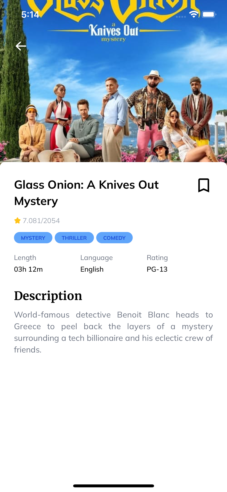

# Filmku App

This is Movie lists app consuming from themoviedb API builds with react native and expo with love.

## Tech Stack

**Client:** React Native, Expo, NativeWind, ReduxToolkit

## Run Locally

Clone the project

```bash
  git clone https://github.com/underworld14/filmku-rn.git
```

Go to the project directory

```bash
  cd filmku-rn
```

Install dependencies

```bash
  npm install
```

Start the project for Ios / Android

```bash
  npm run ios / npm run android
```

## Running Tests

To run tests, run the following command

```bash
  npm run testFinal
```

## Build and publish the app

Make sure you have installed eas-cli on your local

```bash
    npm install -g eas-cli
    eas login
```

To build this project run

```bash
  eas build --platform android
  eas build --platform ios
```

Find the generated bundle on https://expo.dev

## Screenshoots





